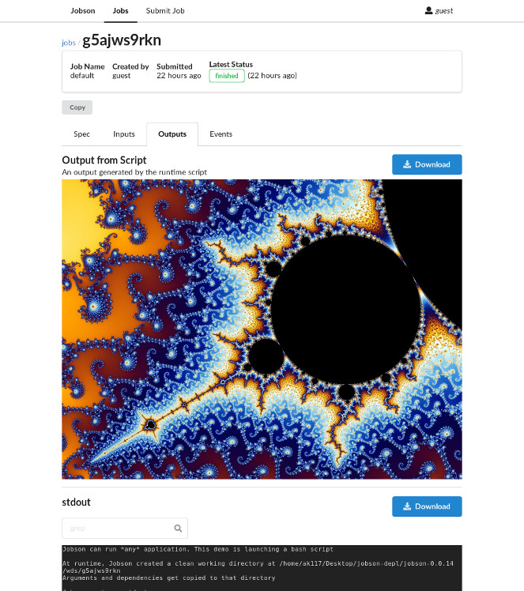
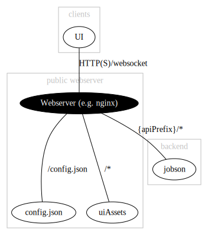

User Interface (Jobson UI)
==========================

The core ``jobson`` server only hosts a JSON/websocket API for
Jobson. ``jobson-ui`` is a set of static web assets that should be
installed separately on a production-grade webserver (e.g. ``apache``,
``nginx``).

Screenshot
----------

Overview
--------

``jobson-ui`` is designed to be hosted as a set of static assets on a
standard webserver. This enables admins to administer the end-user
accessible parts of jobson with their own standard
security/caching/authentication apporaches.

The webserver should serve the ``jobson-ui`` assets as static
files. At runtime, browser clients go through the following steps:

* Clients download ``index.html`` from webserver root
* ``<script>`` tags in the HTML cause clients to download associated
  javascript from webserver root
* The javascript makes clients download ``config.json`` from webserver
  root
* ``config.json`` contains UI configuration options, including an
  ``apiPrefix`` property, which tells clients what to prefix jobson
  API requests with
* Bootstrapping complete: the javascript code can now interact
  with the ``jobson`` API by prefixing request paths with ``apiPrefix``

So, in order to host a UI you will need to:

* Configure a standard webserver to host the ``jobson-ui`` assets
* Change ``config.json`` (default: ``/api``) accordingly
* Configure the webserver to forward any requests beginning with
  ``apiPrefix`` to an active ``jobson`` server

This guide assumes ``nginx`` is the webserver used.

Get ``jobson-ui``
-----------------

tl;dr (longer version `here <#longer-install-guide>`__):

-  Download a
   `release <https://github.com/adamkewley/jobson-ui/releases>`__
-  Unzip it onto a webserver (e.g. `nginx <https://www.nginx.com/>`__)
-  Configure the webserver to reverse-proxy requests beginning with
   ``/api`` to a running
   `Jobson <https://github.com/adamkewley/jobson>`__ server (`nginx
   example </docs/nginx-example-config>`__)
-  *Optional*: Configure the webserver to reverse-proxy websocket
   requests (`nginx example </docs/nginx-example-config>`__) . This is
   only required if you want realtime updates in the UI.
-  Configure the UI by editing ``config.json`` (if necessary)

Jobson UI builds into a set of standard, static, web assets. Those
assets need to be hosted on a standard webserver (e.g.
`nginx <https://www.nginx.com/>`__).

By default, all Jobson API requests made by the UI are prefixed with
``/api``. This prefix can be changed by editing ``config.json``. Your
webserver of choice should be configured with a reverse proxy that
forwards all requests beginning with ``/api`` to a
`Jobson <https://github.com/adamkewley/jobson>`__ server. Jobson UI uses
websockets to listen to events (updates to stdio, new jobs, etc.), so
the webserver should also be configured to forward websockets if you
want dynamic updates in the UI.

This step-by-step guide assumes `nginx <https://www.nginx.com/>`__ is
the webserver:

-  Download a
   `release <https://github.com/adamkewley/jobson-ui/releases>`__ of
   Jobson UI
-  Unzip the assets to the webserver's asset folder (e.g.
   ``/var/www/jobson-ui``)
-  Install `nginx <https://www.nginx.com/>`__ (e.g.
   ``sudo apt install nginx``)
-  Create an nginx config file for the site.
   `This </docs/nginx-example-config>`__ is a starting point
-  Save the config file, ready for nginx (e.g. at
   ``/etc/nginx/sites-available/jobson-ui``)
-  Enable the config file (e.g.
   ``cd /etc/nginx/sites-enabled && ln -s ../sites-available/jobson-ui jobson-ui``)
-  Reload nginx (``nginx -s reload``)
   

Install ``nginx``
-----------------

Configure ``nginx``
-------------------

.. literalinclude:: _static/nginx-example-config
    :linenos:
